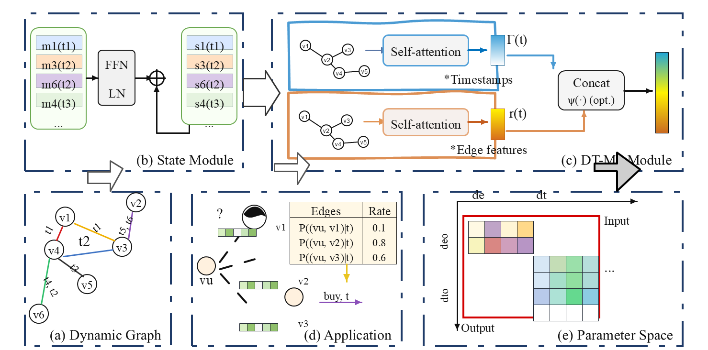

# image2pptx

把图片、截图、论文图和流程图转换成可编辑的 PowerPoint 幻灯片。

先重建语义化 SVG，再转换成 PowerPoint 原生形状和文本。目标不是把截图贴进 PPT，而是让后续可以继续手动微调。

[English README](README.md)


## 演示



上面的图片是从转换后的 PowerPoint 导出的预览图。这个 demo 生成的 PPTX 包含 `212` 个可编辑形状、`68` 段文本、`0` 张嵌入图片。

为了让 GitHub 页面保持轻量，本仓库不提交 demo `.pptx` 文件。需要 PPTX 时在本地运行脚本生成即可。

## 为什么需要 image2pptx

很多 image-to-PowerPoint 工具最后会得到两种不太理想的结果：

- 原图被直接嵌入到幻灯片里，不能编辑
- 看起来像 PPT，但对象难以拆开和微调

`image2pptx` 的路线更偏向论文图和技术图的实际编辑需求：先把图重建成包含文本、矩形、箭头、连接线、图例等元素的语义 SVG，再交给 PowerPoint 转换成原生对象。

## 功能

- 将截图、架构图、科研图、流程图和 PDF 渲染页转换为可编辑幻灯片
- 优先重建文本、框、箭头、图例、连接线和关键图形元素
- 保留 SVG 作为中间产物，方便继续修改
- 导出 SVG 预览图和 PPT 预览图，用于快速检查效果
- 统计 shapes、text runs 和 pictures，判断结果是否真的可编辑
- 当 PowerPoint 无法完整转换时，支持嵌入 SVG 的 fallback

## 工作流程

```text
图片 / 截图 / PDF 渲染页
  -> 语义化 SVG 重建
  -> SVG 预览和修正
  -> PowerPoint 转换
  -> PPTX + 预览图 + 可编辑性报告
```

## 快速开始

```powershell
powershell -NoProfile -ExecutionPolicy Bypass -File ".\scripts\render-svg-preview.ps1" `
  -SvgPath ".\out\figure.svg" `
  -OutputPngPath ".\out\figure-preview.png"

powershell -NoProfile -ExecutionPolicy Bypass -File ".\scripts\svg-to-editable-ppt.ps1" `
  -SvgPath ".\out\figure.svg" `
  -OutputPptxPath ".\out\figure-editable.pptx" `
  -WidthPx 1600 `
  -HeightPx 900

powershell -NoProfile -ExecutionPolicy Bypass -File ".\scripts\export-slide-preview.ps1" `
  -PptxPath ".\out\figure-editable.pptx" `
  -OutputPngPath ".\out\figure-editable-preview.png" `
  -Width 1600 `
  -Height 900

powershell -NoProfile -ExecutionPolicy Bypass -File ".\scripts\inspect-pptx-editability.ps1" `
  -PptxPath ".\out\figure-editable.pptx"
```

## 适用场景

- 论文方法图、模型结构图、系统架构图
- 带文字、箭头、框、表格和图例的技术图
- 需要在 PowerPoint 里继续细调的截图式图表

## 限制

- 最适合结构化图表，不适合自然照片
- 完整可编辑转换依赖 Windows 上的 PowerPoint COM 自动化
- 过于密集的复杂图可能需要局部近似，或退化为 SVG embedded fallback

## 在 Codex 中使用

```text
Use $image2pptx to convert this diagram image into a semantic SVG and editable PPTX.
```

## 贡献

欢迎提交 issue 和 pull request。最有帮助的是带输入图、期望输出和可编辑性问题描述的小型复现案例。
